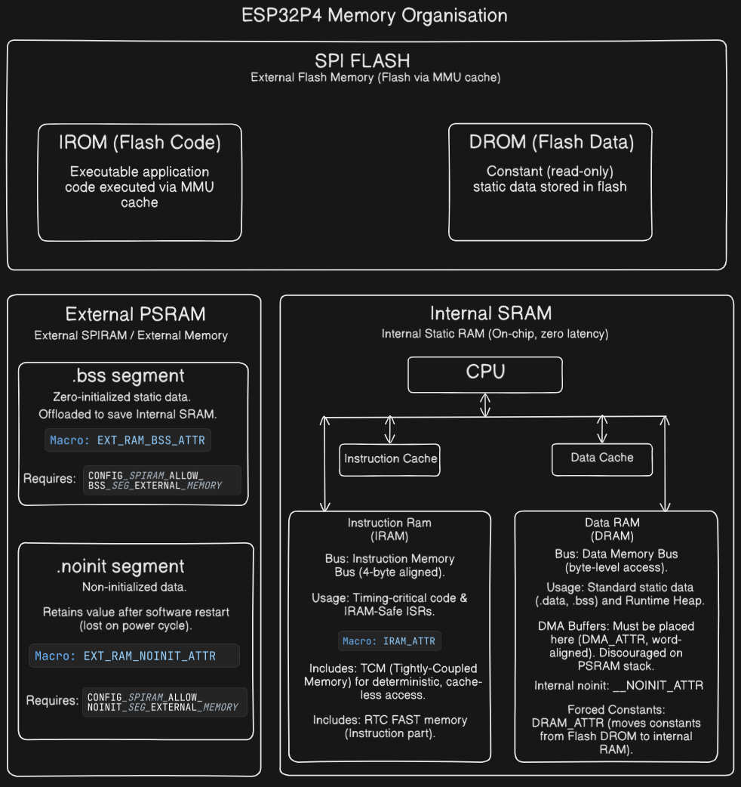
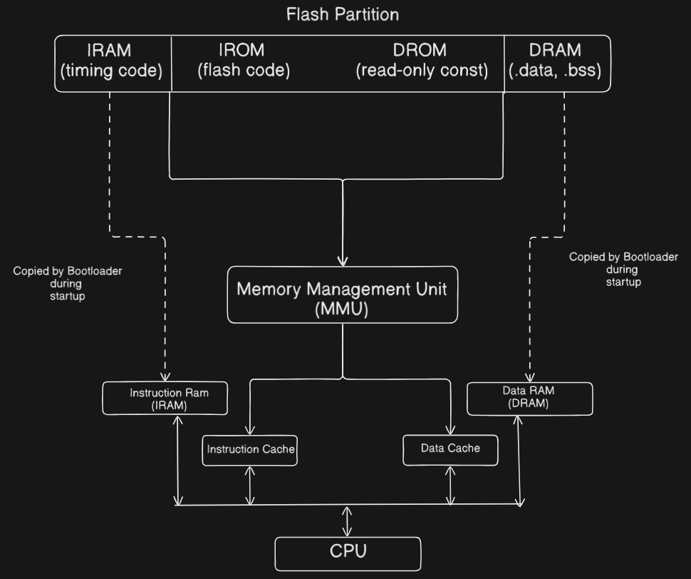
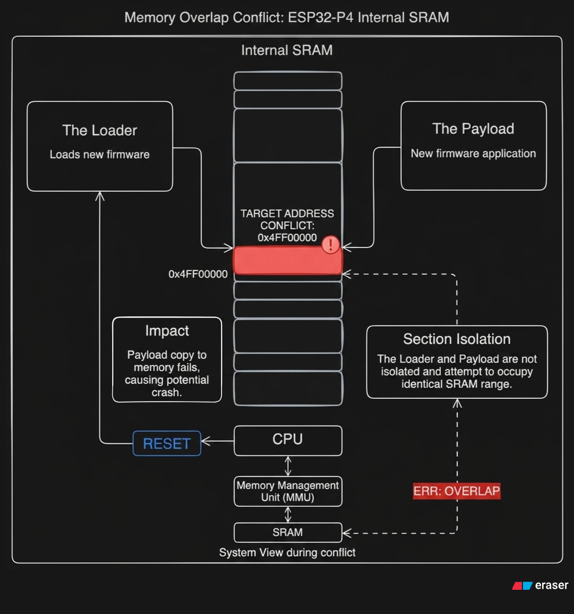
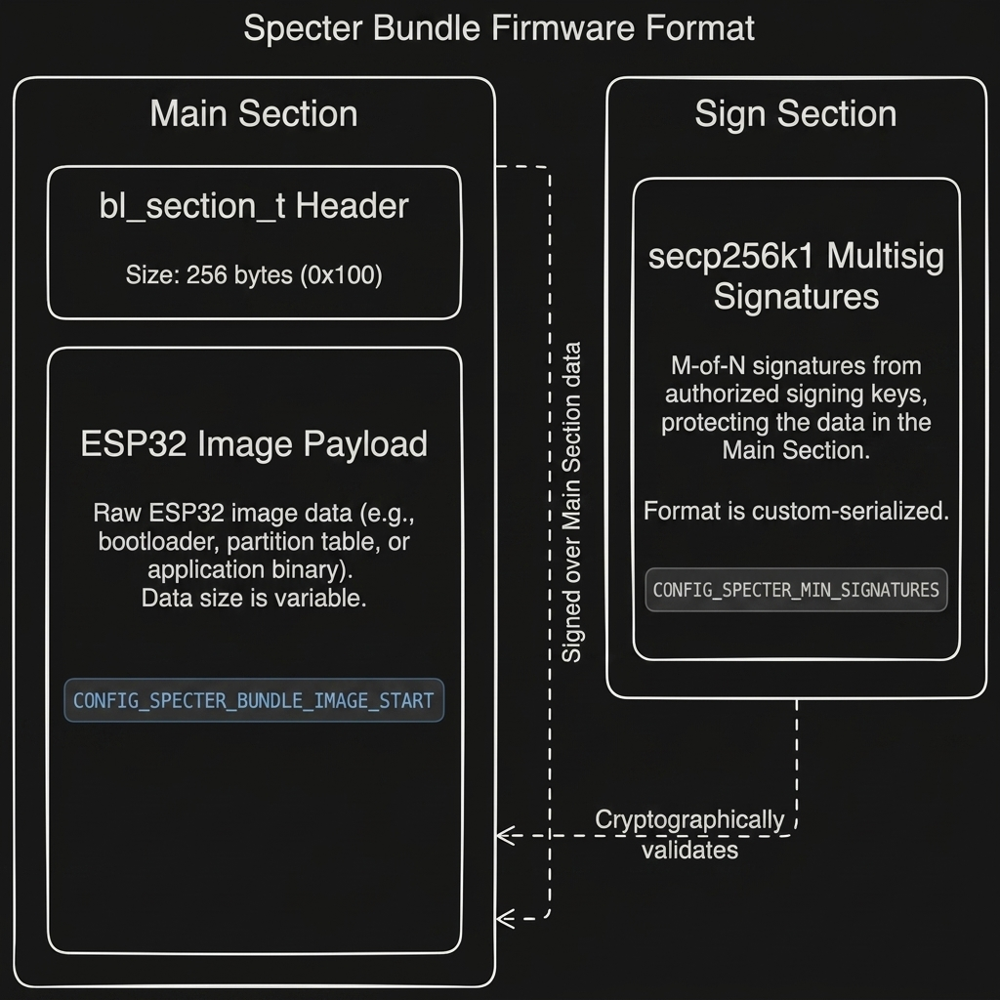
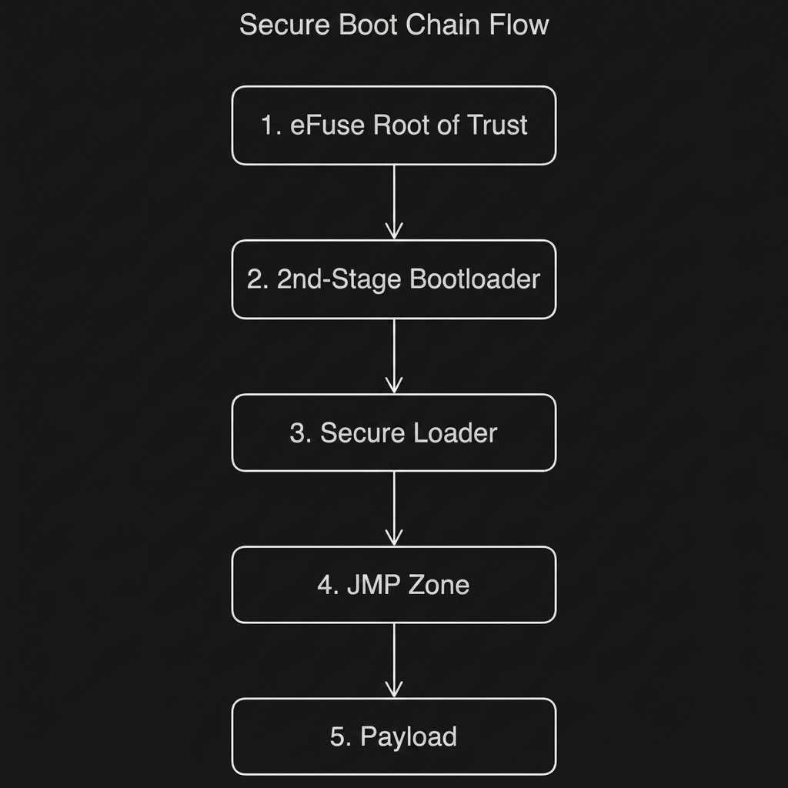

# Bootloader Internals

This document explains the architecture of the `seedsigner-esp32-bootloader`:
what it does, how the code is structured, and why specific design decisions were
made. It covers the ESP32-P4 memory model, the two-layer security chain, the
memory-overlap problem at the heart of the loader-to-payload handoff, and the
implementation details of every major subsystem.

---

## 1. ESP32-P4 memory model

Understanding the P4's memory layout is essential to understanding the
bootloader. The chip has three memory regions that matter:



- **Internal SRAM (HP L2MEM)**: `0x4FF00000`–`0x4FFBFFFF` (768 KB). This is
  fast, on-chip RAM. Timing-critical code runs from IRAM here. Normal variables
  (`.data`, `.bss`) live here as DRAM. The L1 instruction and data caches sit in
  front of it, and a small TCM region provides deterministic, cache-less access
  for hard-realtime paths.

- **External flash (IROM/DROM)**: The bulk of a normal application - executable
  code (`IROM`) and read-only constants (`DROM`) - lives in flash. The CPU
  doesn't execute flash directly; it pages flash through the MMU into the
  instruction and data caches. The CPU fetches from the flash cache window
  (`0x40000000`–`0x44000000`) and the cache handles the rest.

- **External PSRAM**: Up to 32 MB, accessed through a cache window at
  `0x48000000`–`0x4C000000`. Programs can place large `.bss` arrays or heap
  allocations here to save internal SRAM. Like flash, PSRAM access goes through
  the MMU and L1 caches.

### How a normal program uses this



A compiled ESP32-P4 application produces four kinds of segments:

| Segment | Where it lives | How it gets there |
|---------|---------------|-------------------|
| **IRAM** | Internal SRAM | Copied into SRAM at boot |
| **DRAM** (`.data`, `.bss`) | Internal SRAM | Copied into SRAM at boot |
| **IROM** (code) | Flash | Stays in flash, MMU-mapped into the cache window |
| **DROM** (rodata) | Flash | Stays in flash, MMU-mapped into the cache window |

At boot, the bootloader copies the RAM segments into SRAM, configures the MMU
so the caches can see the flash segments, and jumps to the entry point.

### Normal boot sequence

1. **ROM** (silicon-masked): runs a tiny first-stage bootloader.
2. **2nd-stage bootloader** (at flash offset `0x2000`): performs secure boot
   checks, reads the app image from flash, loads its segments, and jumps.
3. **App startup** (`call_start_cpu0`): clears `.bss`, sets up clocks, MMU
   software structures, PSRAM, interrupts, and starts the FreeRTOS scheduler.

A normal application **assumes all of step 2 was done for it**. Its linker
script bakes in fixed addresses (`0x4FF00000` for SRAM, `0x48000000` for
PSRAM-mapped segments), and its startup code assumes the RAM is already filled,
the MMU is mapped, and the caches contain valid data.

---

## 2. What this bootloader does differently

SeedSigner is a hardware wallet. This project implements the **stateless**
security model: the firmware lives on a removable SD card, not in flash. You
update the device by swapping the card. The chip must:

1. Mount the SD card at boot.
2. Read the signed firmware bundle into PSRAM.
3. Verify its cryptographic signature (only SeedSigner-signed firmware runs).
4. Execute the firmware entirely from PSRAM, with onboard flash never written
   after the device is provisioned.

### The two-layer security chain

- **Layer 1 - Secure Boot V2**: The ESP-IDF 2nd-stage bootloader is signed with
  an RSA key whose digest is stored in eFuses. On every boot, the ROM verifies
  the bootloader, and the bootloader verifies the loader image. (In dev mode,
  virtual eFuses are used so no physical fuses are burned -
  `CONFIG_EFUSE_VIRTUAL=y`. The ROM cannot see virtual eFuses, so the
  ROM-stage check is skipped in dev; only the bootloader-to-loader check
  runs.)

- **Layer 2 - the loader**: The loader (`seedsigner_secure_loader.bin`) reads
  the SD bundle, checks a secp256k1 multisig signature against compiled-in
  vendor keys, and only then hands off to the payload.

### The fundamental problem

The loader is a normal ESP-IDF application. The payload (MicroPython) is also a
normal ESP-IDF application. Both are compiled with linker scripts that place
their code and data starting at `0x4FF00000` in internal SRAM. They both want
to occupy the same physical memory.

This collision - two normal programs fighting over one physical address space, 
is the central design constraint of this project. Every unusual pattern in the
codebase exists to resolve it.

---

## 3. The memory overlap problem

The payload's PSRAM-mapped segments (`0x48000000`+) are straightforward: the
loader programs the MMU to point those virtual addresses at the correct PSRAM
physical pages, and the payload runs from PSRAM the same way it would run from
flash. No conflict.

The problem is the payload's SRAM segments. They have fixed load addresses in
internal SRAM (`0x4FF00000`+), so the loader must **copy** them there byte by
byte. But the loader itself occupies `0x4FF00000` too - its own `.text`,
`.data`, `.bss`, and its FreeRTOS task stack all live in the same region it
needs to overwrite with the payload.

This overlap causes four distinct problems, each addressed by a specific piece
of the codebase:



### 3.1 The cache-eviction buffer overwrites the payload

To hand off cleanly, the loader must drain its L1 data cache. It does this by
writing a scratch pattern over a large buffer (`evict_buf`) to force every
dirty cache line out to SRAM. If `evict_buf` lived in the default loader
`.bss` at `0x4FF00000`, and the eviction ran **after** copying the payload
into SRAM, the scratch pattern would physically overwrite the payload's
freshly copied `.data` section. Every initialized global variable in the
payload would be garbage.

**Fix**: The eviction runs **before** the payload copy (the `JMP[4]` step in
`jump.c`). The post-copy drain (`JMP[8]`) is safe because `evict_buf` has been
relocated above `0x4FF40000` by `loader_high.ld`, clear of the payload region.
Ordering is load-bearing here.

### 3.2 The loader's code overlaps the payload's entry point

Even with correct ordering, the payload's entry point address (e.g.
`0x4FF0156C`) falls inside the region the loader's own code was executing from.
Two cache-coherence problems result:

1. **Stale instruction cache**: The P4's L1 I-cache still holds loader
   instructions on the cache lines covering the payload's entry point. When the
   CPU jumps to that address, it fetches stale loader bytes instead of the
   payload.

2. **Dirty data cache**: The byte-by-byte copies into SRAM go through the
   write-back L1 D-cache, so the payload bytes haven't actually reached SRAM
   yet - they're sitting in dirty cache lines.

The obvious fix would be to flush the caches with ROM helper functions. But on
the P4, **the ROM's cache-flush helpers hang for internal-SRAM address ranges**.
`Cache_Invalidate_Addr` and `Cache_Disable_L1_DCache` funnel into an L2 sync
engine that spins forever on `0x4FF0xxxx` addresses. Only external-memory
(PSRAM) ranges complete. The standard cache-management path is not available.

**Fix (part 1 - relocation)**: The linker script `loader_high.ld` redefines the
`MEMORY` regions so the loader's entire footprint moves up to `0x4FF40000`+.
Now the loader never executes from the payload's address range, so the payload's
entry line is always a cold cache miss - no stale I-cache problem. GNU ld allows
a later `MEMORY` declaration to override an earlier one (emitting only a
"redeclaration of memory region" warning, which is expected and harmless).

**Fix (part 2 - cache drain)**: Instead of ROM cache calls, the loader writes
the entire `evict_buf` (262144 bytes, ~4× the 64 KB L1 D-cache) after the
copies. Writing this many distinct addresses forces every set and way in the
cache, including the dirty payload lines, to be written back to SRAM. This is
the `JMP[8]` step in `jump.c`.

### 3.3 The FreeRTOS stack overlaps the payload

The FreeRTOS main-task stack is carved from the low heap region and lands at
around `0x4FF04590` - inside the payload's SRAM `.text`. The jump sequence runs
on that stack, and its stack-local format strings overwrite freshly copied
payload code. The D-cache drain then bakes this corruption into SRAM.
Additionally, the RISC-V hardware stack guard (`assist_debug`) monitors the
main task's original stack bounds and faults the moment the payload inherits
that stack pointer and moves it outside those bounds.

**Fix**: `jump.c` defines a dedicated 32 KB `jump_stack` in the relocated
loader region (above `0x4FF40000`). A `__attribute__((naked))` trampoline
(`do_mmu_mapping_and_jump_trampoline`) switches `sp` to this stack before any
payload work begins. Inside the trampoline's inline assembly, the hardware
stack guard is neutralized: `SP_MIN` is set to `0`, `SP_MAX` to `0xFFFFFFFF`,
and the spill-latch enable bits are cleared (`ASSIST_DEBUG_CORE_0_INTR_ENA_REG`
at `0x3FF06000`). This prevents the payload from being faulted for moving the
stack pointer.

### 3.4 The linker script declared RAM that overlaps L2 cache hardware

The original `loader_high.ld` declared a `sram_high` region at `0x4FFA0000`.
This address range **statically overlaps the P4's hardware L2 cache**. As long
as no code or data was placed there, it was harmless. But when the loader grew
larger (the anti-phishing module pulled in more ESP-IDF components), the linker
spilled `.bss` into `sram_high`. When the L2 cache turned on during early boot,
it corrupted those variables, causing crashes in partition loading.

**Fix**: `sram_high` is declared with `len = 0` so nothing can be placed there.
The entire loader fits within the safe `0x4FF40000`–`0x4FFA0000` window, aided
by `CONFIG_COMPILER_OPTIMIZATION_SIZE=y` to keep the binary small enough.

### The pattern

Every one of these problems is the same disease: the loader is a program that
runs on the same RAM the payload is about to be loaded into. The cure is always
"get out of the way" - relocate, dedicate separate memory, reorder operations,
or shrink.

---

## 4. Boot flow in detail

### 4.1 SD card load (`storage.c`)

`load_firmware_from_sd()` mounts the SD card via the SDMMC peripheral (4-bit
bus, on-chip LDO channel 4 for power), reads `seedsigner_esp32p4.bin` into a
64 KB-aligned PSRAM buffer, and **unmounts the card immediately**. Everything
after this point operates on the PSRAM-resident copy only. This prevents a
TOCTOU (time-of-check-to-time-of-use) attack where an attacker could swap the
SD card between verification and execution.

The firmware filename is 22 characters, which exceeds the FAT 8.3 short-name
limit. Without `CONFIG_FATFS_LFN_HEAP=y`, FatFs would match short names only,
and the loader would report the file "not found" despite a successful mount.

### 4.2 Specter bundle verification (`main.c`)

The SD file is not a raw binary. It uses the Specter bundle format: a "main"
section (256-byte `bl_section_t` header + the raw ESP32 image) followed by a
"sign" section. The loader validates the bundle in this order:



1. **Header validation**: Checks the Specter magic number and structural
   integrity via `blsect_validate_header()`.

2. **Platform check**: Reads the platform attribute string and rejects anything
   other than `"seedsigner_esp32p4"`. This prevents loading firmware built for
   a different board.

3. **Version check**: Rejects bundles with `pl_ver < 1`, preventing firmware
   downgrades.

4. **Hash**: Computes a SHA-256 hash of the entire main section (header +
   payload) from the PSRAM copy.

5. **Signature verification**: Builds a Bech32 "Bitcoin Signed Message"-style
   message from the hash and verifies a secp256k1 multisig against the
   `pubkeys_boot` array compiled into the loader from
   `keys/<profile>/vendor_keys.c`.

   `blsig_verify_multisig()` returns a **count** of valid signatures, not a
   boolean - and negative values indicate errors. The loader explicitly checks
   `sig_res >= SIG_THRESHOLD`. Without this check, a bundle signed by an
   unknown key (zero valid signatures, which is not a negative/error value)
   would pass verification. This was a real bug found during security analysis.

   The secp256k1 verification is computationally expensive. A `vTaskDelay(1)`
   progress callback yields to the idle task periodically so the system doesn't
   appear hung. The main task isn't auto-subscribed to the TWDT in IDF v5, so
   `esp_task_wdt_reset()` is unnecessary.

6. **Failure handling**: On any failure, the PSRAM buffer is zeroed with
   `memset()` and the loader halts in an infinite loop. The firmware image is
   never left in memory after a failed verification.

### 4.3 Anti-phishing proof (`anti_phish.c`)

The anti-phishing module is a human-facing tamper check. It works as follows:

**Provisioning** (`provision_flash_fill()`): On first boot, a large partition
(`random_fill`, ~6.8 MB) is filled with TRNG random data. Its SHA-256 hash is
computed and stored in a small `nvs` partition (custom subtype `0x99`) alongside
an `AP_MAGIC` marker (`0x41504F4B`). This is a one-time operation; subsequent
boots skip it when the magic is already present.

**Verification** (`verify_anti_phishing_proof()`): Every boot, the loader
re-hashes the entire `random_fill` partition and compares the result against the
stored hash:

- **Match**: 4 BIP-39 words are derived from the hash digest
  (`derive_bip39_words()`) and printed to the console. Each word is selected by
  extracting 11 bits from the hash (2048 words × 11 bits = the standard BIP-39
  index space), giving 4 × 11 = 44 bits of entropy.

- **Mismatch**: Someone modified the flash. The loader wipes the PSRAM buffer
  and halts. Boot is refused.

The user is expected to record these four words when the device is first
provisioned. If an attacker reflashes, swaps, or otherwise tampers with the
device, the words change - and the user can see the discrepancy. 44 bits of
entropy is sufficient to catch casual evil-maid attacks; stopping a determined
attacker with code execution would require a future HMAC-eFuse binding.

This is why `bip39_wordlist.c` (all 2048 standard BIP-39 words) is compiled
into the loader, and why the partition table's unallocated bytes add up to
exactly zero - every byte of flash is accounted for.

### 4.4 Image parsing and load plan (`esp_image.c`)

`esp_image_plan()` parses the raw ESP32 image embedded inside the Specter
bundle and builds a load plan:

1. **Header validation**: Checks the `0xE9` magic byte and that the segment
   count is within bounds (`MAX_SEGMENT_COUNT = 16`).

2. **First pass - measure PSRAM footprint**: Walks all segments to find the
   maximum extent of PSRAM-mapped addresses (`0x48000000`–`0x4C000000`),
   rounded up to 64 KB page boundaries.

3. **Allocate fake-flash buffer**: A 64 KB-aligned PSRAM buffer (`fake_flash`)
   is allocated to stage the MMU-mapped segments. The loader calls
   `esp_mmu_vaddr_to_paddr()` to get the physical PSRAM address backing this
   buffer - the JMP zone needs physical addresses for direct MMU programming.

4. **Second pass - place segments**: Each segment is classified:
   - **PSRAM-mapped** (`vaddr ≥ 0x48000000`): segment data is copied into the
     `fake_flash` buffer at the correct offset. An `mmu_mapping_t` record is
     created with the virtual address, physical address, and length.
   - **Internal SRAM** (all other addresses): a `pending_copy_t` record is
     created with `dest`, `src` (pointing into the PSRAM buffer), and `len`.
     The actual copy is **deferred** - it happens in the JMP zone after caches
     and interrupts are disabled.

5. **Cache writeback**: The staged `fake_flash` buffer is flushed from the
   D-cache to physical PSRAM (`Cache_WriteBack_Addr`) so the MMU maps will see
   coherent data.

The resulting `image_plan_t` contains everything the JMP zone needs: the entry
address, the MMU mappings, and the deferred SRAM copies.

### 4.5 Plan commit to RTC RAM (`main.c`)

Before entering the JMP zone, `app_main` copies the load plan into RTC RAM
variables: `safe_entry_addr`, `safe_mappings[]`, `safe_mapping_count`,
`safe_copies[]`, `safe_copy_count`. These variables are declared with
`RTC_DATA_ATTR` in `jump.c`.

RTC RAM is the only memory that survives the transition from the "cached, normal
ESP-IDF runtime" world into the "cache-off, point of no return" world. Regular
SRAM variables would be unreliable once the cache state changes; RTC RAM is
not cached and is directly addressable regardless of cache configuration.

---

## 5. The JMP zone (`jump.c`)

The JMP zone is the point of no return. Once entered, there is no way back to
the loader's normal runtime. Every line runs with interrupts disabled, on a
dedicated stack, using only ROM-safe operations (no libc, no `ESP_LOG`, no
`malloc`). The code has its own bare-metal UART print function
(`bootloader_uart0_print`) that writes directly to the UART0 FIFO registers
(`0x500CA000` for data, `0x500CA01C` for status) because once interrupts and
caches are disabled, no higher-level I/O can be trusted.

### 5.1 Trampoline entry

`do_mmu_mapping_and_jump_trampoline()` is a `naked` function. It:

1. Masks interrupts via `csrw mie, zero` to prevent tick interrupts from
   re-arming the stack monitor.
2. Neutralizes the RISC-V hardware stack guard at `0x3FF06000`:
   - Sets `SP_MAX` to `0xFFFFFFFF` and `SP_MIN` to `0x00000000` (full range).
   - Clears any latched spill interrupt.
   - Clears the `SP_SPILL_MIN_ENA` and `SP_SPILL_MAX_ENA` bits.
3. Switches `sp` to the top of `jump_stack` (32 KB, 16-byte aligned, in the
   relocated loader region).
4. Calls `do_mmu_mapping_and_jump()`.

### 5.2 Teardown (JMP[1]–JMP[3])

The function disables everything that could interfere with the handoff:

- **Interrupts**: `portDISABLE_INTERRUPTS()`, then `csrw mie, zero` and
  `rv_utils_intr_global_disable()`.
- **Hardware watchpoints**: `esp_cpu_clear_watchpoint(0)` and `(1)`.
- **All watchdogs**: SWD, LP_WDT, MWDT0, MWDT1, and RWDT are disabled via
  raw register writes. The unlock sequence writes the magic value `0x50D83AA1`
  to the write-protect register, modifies the config, and re-locks. Timer group
  watchdogs use both raw register writes and the `wdt_hal` API for
  thoroughness.
- **Systimer and timer-group interrupts**: Silenced and cleared to prevent any
  pending interrupt from firing during or after the jump.

### 5.3 Pre-copy cache eviction (JMP[4])

Before copying the payload, the loader writes a pattern over the first 64 KB
of `evict_buf` to force the L1 D-cache to evict any dirty lines from the
loader's normal operation. This ensures the cache is in a known state before
the SRAM copies begin.

### 5.4 Direct SRAM copies (JMP[5])

The deferred copies are executed: each `safe_copies[i]` entry is a byte-by-byte
copy from PSRAM (source) to internal SRAM (destination). After this step, the
payload's SRAM segments are in the D-cache (and may or may not have been
written through to SRAM yet - the cache is write-back).

### 5.5 MMU programming (JMP[6])

For each MMU mapping, the loader programs the P4's MMU entry registers
directly:

- Computes the MMU entry ID from the virtual address:
  `entry_id = (vaddr & 0x03FFFFFF) >> 16`.
- Computes the MMU value from the physical address: `mmu_val = paddr >> 16`.
- For addresses in the PSRAM window (`>= 0x48000000`), uses the `SPI_MEM_S`
  registers and sets bits 11 and 10 (`(1 << 11) | (1 << 10)`).
- For flash window addresses, uses `SPI_MEM_C` registers with just bit 10
  (`(1 << 10)`).
- Writes `entry_id` to the index register and `final_val` to the content
  register. Each 64 KB page is programmed individually.

### 5.6 Cache invalidation and fence (JMP[7])

After reprogramming the MMU, the loader invalidates the caches for the remapped
regions using `Cache_Invalidate_Addr()`. This works because the remapped
regions are in the **external-memory** address space (PSRAM at `0x48000000`),
where the ROM cache helpers function correctly. A `fence.i` instruction
ensures the instruction pipeline sees the new mappings.

### 5.7 Post-copy D-cache drain (JMP[8])

The SRAM copies (step 5.4) went through the write-back D-cache, so the payload
bytes are still dirty in cache - not yet in physical SRAM. The loader cannot
use the ROM's cache-flush helpers for internal-SRAM ranges (they hang). Instead,
it writes the entire 262144-byte `evict_buf` with distinct values, forcing
every set and way in the L1 D-cache to be evicted. Since `evict_buf` is in the
relocated loader region (above `0x4FF40000`), it doesn't overwrite the payload.
The evicted dirty payload lines are written back to SRAM as a side effect.

### 5.8 Final CSR teardown

The loader zeros `mtvec` (interrupt vector base) and all PMP (Physical Memory
Protection) CSRs (`0x3A0`–`0x3BF`) so nothing left over from the loader traps
or constrains the payload's memory access.

### 5.9 Jump

A function pointer cast to `entry_t` (a `noreturn` function pointer) is called
with `safe_entry_addr`. The CPU begins executing the payload.

---

## 6. The stateless shim (payload side)

The payload is a stock ESP-IDF application (MicroPython). It expects the
2nd-stage bootloader to have done all the normal boot work - clearing `.bss`,
setting up clocks, configuring the software MMU context, installing interrupt
vector tables, and adding PSRAM to the heap. The loader jumps straight to the
payload's custom entry point and skips all of that.

The MicroPython build carries a small component called the **stateless shim**
that reconstructs the missing handoff:

- **`my_entry_point`** (naked): Enables the FPU, sets the `gp` (global pointer)
  register, and points `sp` at a safe stack - all before the compiler can emit
  a float-instruction prologue while the FPU is still off.

- **`__wrap_call_start_cpu0`**: Clears `.bss`, does early init, and tail-calls
  the real `call_start_cpu0`. Uses `--wrap` linker stubs to neutralize the
  hardware-destructive init functions that would reset the PSRAM/flash/MMU
  state the loader already configured.

- **CLIC vector table installation**: Right before `esp_startup_start_app()`,
  the shim installs the payload's own CLIC vector tables. In a normal boot,
  `call_start_cpu0` → `init_cpu()` does this. The shim replaces
  `call_start_cpu0`, so it must do this itself. Without it, the FreeRTOS tick
  hooks never fire, the interrupt watchdog re-arms, and the chip resets with
  `rst:0x7 (HP_SYS_HP_WDT_RESET)`.

The `.data` copying is done by the loader (the direct copies in the JMP zone),
so the shim must not duplicate it. The division of responsibility between "what
the loader copies" and "what the shim initializes" is a sensitive boundary.

---

## 7. Vendor key management

The secp256k1 vendor signing keys are a **build-time profile**. The CMake cache
variable `VENDOR_KEYS_PROFILE` (default: `test`) selects which key set is
compiled into the loader from `keys/<profile>/vendor_keys.c`:

- **`keys/test/`**: Development keys, shipped in-repo so the project builds out
  of the box. These are not secret.
- **`keys/production/`**: Production keys, generated offline with
  `tools/generate_vendor_key.py` and never committed to the repository.

Switch profiles with: `idf.py -DVENDOR_KEYS_PROFILE=production build`.

Additional tooling:
- `tools/generate_signed_payload.py`: Signs a raw firmware image with the
  vendor keys.
- `tools/package_firmware.py`: Packages the signed image into the Specter
  bundle format.

---

## 8. Configuration choices (`sdkconfig.defaults`)

Several non-obvious configuration settings exist for specific reasons:

| Setting | Reason |
|---------|--------|
| `CONFIG_FATFS_LFN_HEAP=y` | The filename `seedsigner_esp32p4.bin` is 22 chars, exceeding the 8.3 short-name limit. Without LFN support, the file is invisible to FatFs. |
| `CONFIG_EFUSE_VIRTUAL=y` | All eFuse reads/writes are simulated in RAM. No physical fuses are burned during development. `KEEP_IN_FLASH` persists the virtual state across reboots using the `efuse` data partition. |
| `CONFIG_ESP_SYSTEM_PMP_IDRAM_SPLIT=n` | The PMP-based IRAM/DRAM split protection faults when the loader relocates and overwrites IRAM at `0x4FF00000`. Must be disabled. |
| `CONFIG_ESP_ENABLE_PVT=n` | PVT auto-tuning of HP/LP voltage is disabled for debug stability. |
| `CONFIG_COMPILER_OPTIMIZATION_SIZE=y` | The loader must fit within `0x4FF40000`–`0x4FFA0000` (384 KB). Size optimization makes this possible. |
| `CONFIG_FREERTOS_UNICORE=y` | Only one core is used. |
| `CONFIG_SPIRAM=y` / `SPEED_80M` | PSRAM enabled at 80 MHz. The P4 uses a dedicated HEX SPI-PSRAM interface. The loader itself runs from flash/SRAM, so no XIP-from-PSRAM toggles (`SPIRAM_FETCH_INSTRUCTIONS`/`RODATA`) are needed here. (The MicroPython payload does use them for PSRAM XIP.) |

---

## 9. Partition table

```
Name          Type  Subtype  Offset     Size
nvs           data  0x99     0x21000    0xC000
otadata       data  ota      0x2D000    0x2000
phy_init      data  phy      0x2F000    0x1000
factory       app   factory  0x30000    0x100000
efuse         data  0x05     0x130000   0x2000
random_fill   data  0x06     0x132000   0x6CE000
```

- **`nvs`** (subtype `0x99`): Stores the anti-phishing state (`anti_phish_state_t`: magic + SHA-256 hash). Uses a custom subtype rather than the standard NVS subtype because the anti-phishing module writes raw structures directly, not NVS key-value pairs.
- **`efuse`**: Stores virtual eFuse state across reboots (`CONFIG_EFUSE_VIRTUAL_KEEP_IN_FLASH`).
- **`random_fill`** (~6.8 MB): Filled with TRNG random data on first boot for the anti-phishing proof. Every byte of the 8 MB flash is accounted for.

---

## 10. Complete boot chain



```
eFuse root of trust (Secure Boot V2, RSA)
   └─ 2nd-stage bootloader (0x2000)
       └─ seedsigner_secure_loader.bin (0x30000, a normal ESP-IDF app)
           ├─ mount SD card → read seedsigner_esp32p4.bin into PSRAM
           ├─ unmount SD card (TOCTOU-safe)
           ├─ validate Specter header + platform + version
           ├─ verify secp256k1 multisig against vendor_keys[] (≥ SIG_THRESHOLD)
           ├─ provision / verify anti-phishing proof → print 4 BIP-39 words
           ├─ parse ESP32 image → build load plan
           │    ├─ PSRAM segments (0x48000000…) → stage in fake_flash → MMU map
           │    └─ SRAM segments (0x4FF00000…) → deferred direct copies
           └─ JMP zone (jump.c, on jump_stack, cache-off)
                ├─ kill watchdogs + interrupts + stack guard + PMP
                ├─ evict D-cache (pre-copy)
                ├─ copy SRAM segments
                ├─ program MMU → invalidate caches → fence.i
                ├─ drain D-cache into SRAM (post-copy, evict_buf)
                ├─ zero mtvec + PMP CSRs
                └─ jump to payload entry
                    └─ stateless shim → real call_start_cpu0 → FreeRTOS
                        └─ MicroPython REPL, running entirely from PSRAM
```

The central constraint behind every design decision: **the loader is a normal
program handing off to another normal program, and they both want the same
RAM.** The relocation script, the dedicated stack, the naked trampoline, the
cache-eviction dances, the ordering rules, the shim, and the RTC-RAM handoff
all exist to get the loader out of the payload's way, hand the payload a clean
machine state, and jump.
