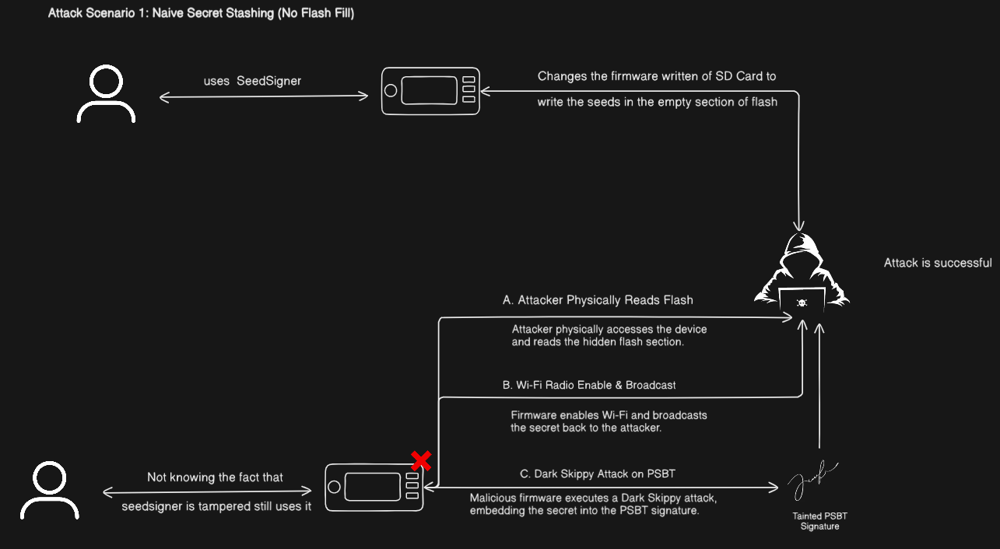
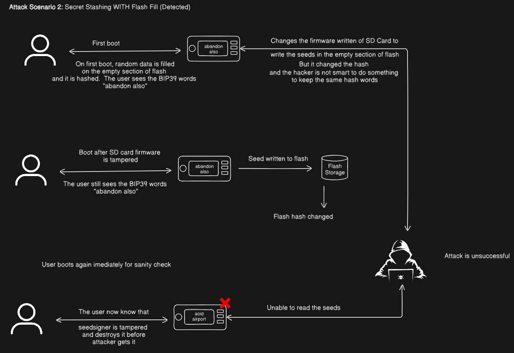
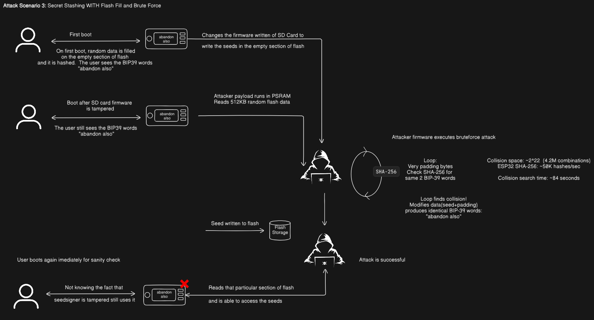

# Security Analysis

This document is the companion to `bootloader_explanation.md`. That document
explains how the code works. This one asks what happens when someone tries to
break it.

The scope is the entire boot chain: the hardware root of trust (Secure Boot
V2), the loader application, the SD-card bundle, and the anti-phishing proof.
Twelve attack scenarios are walked through below, each verified either on real
silicon or analysed host-side. Everything exercised here is reversible - flash
writes only, no eFuse burns, no secure-boot provisioning. The dev board uses
virtual eFuses (`CONFIG_EFUSE_VIRTUAL=y`), so the Layer-1 checks run on real
silicon without physically burning anything.

---

## 1. Who the attacker is

Four adversary classes were considered.

A **remote software attacker** has no physical access. They can push files to
the SD card - a compromised host that copied a firmware file, or a dropped card
the user later reinserts. The SD card bundle is the surface they control most
completely.

A **physical mauler** (the evil-maid scenario) has temporary access to the
device. They can swap SD cards, clone SD cards, read flash over serial or SPI,
and freeze the chip. They cannot leave visible traces and cannot burn eFuses
silently - burns are one-time and need a power cycle the user would notice.

A **supply-chain attacker** compromises a firmware build, a signing step, or a
factory provisioning step. The question modelled is "what does one compromised
key buy you?"

**Not modelled**: sub-microsecond glitch injection, die decapping, and active EM
analysis. For a hardware-wallet bootloader these are out of scope. The device is
sealed and user-held, and the crypto boundary is the seed, not the wallet's
chip. A determined attacker with decapping equipment is outside the threat model
for a ~$100 consumer device.

---

## 2. The attack surface

Everything in flash is Layer-1 signed. The `random_fill` partition is unseeded
TRNG data that cannot be precomputed. JTAG is a production eFuse question. The
only surface where the attacker holds all the bytes is the SD card bundle. Every
scenario below revolves around that bundle, the signatures, and the physical
tricks that try to sidestep both.

---

## 3. Attack scenarios

### A1. Hiding a stolen seed in empty flash

Without the flash fill, this is trivial. The runtime firmware runs statelessly
from PSRAM, but nothing stops it from writing to onboard flash. Empty sectors
accept writes silently. A malicious firmware steals the user's seed, parks it in
a free sector, and the next boot has no way to notice. The attacker retrieves
the seed later - either by physically reading the flash, by having the
malicious firmware enable the Wi-Fi radio and broadcast it, or by running a
Dark Skippy attack that embeds the seed into a PSBT signature the user signs
without realising anything is wrong.

The flash-fill partition exists to remove this assumption. The ~6.8 MB
`random_fill` region is TRNG-filled on first boot. There are no empty sectors
to stash anything in.

### A2. Hiding a stolen seed when flash fill is active

Now the attacker has a harder problem. To write anything to flash, they must
first erase a sector - flash physics demands it. That erase destroys the TRNG
bytes, so the next boot's SHA-256 hash differs from the stored digest.

During the attack boot, the malicious firmware can fake the display and show
the original words ("abandon also" in the diagram) while silently writing the
stolen seed to flash. But the flash hash has already changed. When the user
boots again for a sanity check, the derived words are different - "acid
airport" instead of "abandon also" - and the user knows the device is
compromised. In the current implementation this detection is pushed even
earlier: the bootloader itself catches the hash mismatch, prints
`FLASH TAMPERED! Hash mismatch detected.`, and halts before any firmware runs.

This was verified on the real board two ways. A single-byte flip at `0x132000`
(the start of `random_fill`) triggered the tamper halt. Separately, flipping
`state.hash[0]` in the NVS blob at `0x21004` also triggered it. Both paths
work.

The write costs the attacker their secrecy: they get the seed, but the user
knows about it on the next boot. The window is between the write and the next
power cycle.

### A3. Brute-forcing a hash collision

The determined attacker asks: can I find data that hashes to the same anti-phishing
words? If so, they erase the partition, write their modified version (with the
seed hidden inside), and the words still match.

The diagram below shows how this works. The attacker's payload reads the
random flash data, then loops: vary some padding bytes, rehash, check whether
the derived words still match. The diagram is from an earlier prototype that
used a 512 KB partition and only 2 words - a collision space of ~2²² (~4.2M
combinations). At ~50K SHA-256 hashes/sec on an ESP32, that search took
roughly 84 seconds. The attack succeeded.

The current implementation closes this. The partition is now ~6.8 MB and the
check uses 4 words (2⁴⁴ combinations). The math shifts from seconds to years:

- **Naive full-region rehash** (re-hashing all ~6.8 MB per candidate): 149 ms
  per try. At 2⁴⁴ tries for 4 words, that is ~83 million years. Not tractable.

- **Incremental trailing-block** (read the region once, rehash only the last
  block): 1.29 µs per try. ~262 days on a host, ~3.6-5.9 years on the device.
  This is the real threat.

- **Flash-write bound** (one sector erase per candidate): 40 ms per try.
  ~22,314 years. Not tractable, but this is the on-device ceiling.

The incremental attack is the only one that matters. It is months-to-years, not
seconds. But it is still finite, which is why A4 is the endgame.

### A4. Killing the brute force with an HMAC eFuse key

The collision attack works because the attacker can compute SHA-256 of candidate
data in software. Mix a secret eFuse key into the digest - make it
`HMAC(eFuse_key, SHA-256(flash_data))` - and the attacker loses that ability.
They cannot read the key, so they cannot compute the expected digest.

If the key is provisioned with the `HMAC_KEY_DOWNSTREAM` purpose, the HMAC
peripheral refuses to return a result to normal firmware at all. Even an
`UPSTREAM` key rate-limits the search to one hardware call at a time. The
flash-write-bound row (~22,314 years) is the relevant ceiling once the key is
on-chip.

This is the production plan (§6). The current prototype does not burn any
eFuses, so the HMAC binding is designed but not yet implemented.

### A5. Swapping the physical device (evil-maid)

The anti-phishing words are supposed to catch a swapped device: the user boots
a stranger's unit, sees different words, and stops. But a patient attacker can
clone the entire device - flash and SD card - so the clone produces the same
words. The TRNG bytes, the digest, and the words all come along for free.

Flash fill alone cannot stop a full swap. The defence is
device-specific state that cannot be cloned. The HMAC eFuse binding (A4) is the
in-band version: different chip, different eFuse key, different words. An
out-of-band version would be a physical sticker or an external verifier.

### A6. Compromised supply chain

Two things stand between a factory-swapped firmware and the user. Layer 1: with
Secure Boot V2 physically enabled, the ROM rejects any bootloader the factory
did not sign. Layer 2: erasing and reflashing the flash destroys the TRNG fill,
so the words change.

For the current prototype, none of this matters because the signing key is a
shared dev/test key (gitignored, so not in the repo). Anyone with a copy of it
can produce a validly-signed malicious bundle without touching the bootloader.
This is the same exposure as A12, and the same fix: rotate the key offline for
production (§6).

### A7. Replacing the loader in flash

This is the Layer-1 gate. The 2nd-stage bootloader verifies the loader's RSA
signature against the eFuse digest on every boot. Both rejection modes were
tested on silicon:

A loader signed with a rogue RSA key was rejected with `image valid, signature
bad` -> `Secure Boot V2 verification failed`. The board looped 72 times before
the correct loader was restored.

A loader with its signature block stripped was rejected with `No signature block
generated for valid scheme` -> `Secure boot signature verification failed`,
looping 71 times.

The one case that could not be demonstrated is a tampered *bootloader* at
`0x2000`. That check is the ROM's job, and the ROM cannot see virtual eFuses -
it skips the check entirely under `CONFIG_EFUSE_VIRTUAL`. Demonstrating it
requires a physical `SECURE_BOOT_EN` burn, which is off-limits on the dev board.

### A8. Malicious SD bundle

This is the Layer-2 gate, and the surface the attacker controls most
completely. The bundle must pass, in order: the section magic, the header
validation, the platform attribute, the version floor, the SHA-256 hash, and
the secp256k1 multisig. One nuance matters: `blsig_verify_multisig()` (vendored
from the Specter project) returns the *count* of valid signatures, not a
boolean - zero means "no recognized key signed this" and is a legitimate result,
not an error - so the loader must enforce a floor (`sig_res >= SIG_THRESHOLD`,
currently 1, main.c:137) or an unknown-key bundle would count as success. The
campaign mutated the bundle at each of these points:

A payload bit-flip halted at the signature check. A rogue-key signature halted
at the threshold (`0 valid signature(s), need 1`). A raw image with no Specter
header was rejected. A wrong platform (`seedsigner_esp32s3`) was rejected. A
downgraded version (`pl_ver=0`) was rejected. A truncated signature section was
rejected. A forged `pl_size` caused an out-of-bounds read, then halted.

Every mutation stopped at exactly the check it violated. The only way through
is a bundle signed by a key the loader recognizes.

### A9. Swapping the SD card mid-boot (TOCTOU)

A time-of-check / time-of-use attack needs the loader to verify bytes at one
moment and use different bytes at another. The loader closes this structurally:
`load_firmware_from_sd()` reads the entire bundle into PSRAM, then unmounts the
card, then returns. Verification runs against the PSRAM copy. No card -
physical or malicious - can substitute bytes after the signature check.

### A10. Firmware for the wrong board

Each bundle carries a `platform` attribute string. The loader requires it to
equal `seedsigner_esp32p4`. An S3-targeted bundle was tested on the real board
and stopped at `Invalid platform attribute: 'seedsigner_esp32s3'`. No image
parsing happened.

### A11. Firmware downgrade

The loader enforces a version floor: `pl_ver < 1` halts. This was verified
on silicon with a `pl_ver=0` bundle.

This is a floor, not a rollback counter. The loader itself has no anti-rollback
- that would need eFuse-burned boot-version counters (§6). An attacker can
downgrade within the allowed version space (anything >= 1) until counters are
in place.

### A12. Forging a bundle with the dev key

This is the most important scenario. Every check in A8 exists to ensure only
SeedSigner-signed payloads execute. But "SeedSigner-signed" today means "signed
with the private key in `payload_signing_key.pem`" - a shared test key sitting
unencrypted on the developer machine.

Any attacker who obtains that key can build a bundle whose payload is arbitrary
ESP32 code, sign it, and the loader accepts it. The signature is
cryptographically valid. Once attacker code runs, it has full PSRAM and flash
access. It can read the boot-time words, impersonate the UI, or extract state.
Because the key is gitignored, cloning the repository alone does not confer it -
the exposure is the shared unencrypted test key, not a repo commit.

On the other side of the ledger, a bundle signed by an *unknown* key is rejected
on silicon (the threshold check, A8). The attack is precisely gated on key
secrecy - not on any code flaw.

The fix is not code. No code change can make a private key secret. The fix is
key rotation (§6): generate a new key offline, compile its public half into the
production loader, and never let the private half leave the offline signer.

---

## 4. Attacks that were considered and deliberately not tested

These are out-of-scope for the campaign, recorded here so the analysis is
visibly bounded.

**Cold-boot PSRAM read.** Freeze the chip, power-cycle, read DRAM contents.
PSRAM is working memory - the seed is user-entered and transient, not parked
across power loss. A cold read yields stale runtime state, not a persistent
secret. Not a boot-integrity issue.

**Voltage/EM fault injection.** Glitch the RSA or secp256k1 check to skip it.
Requires sub-microsecond timing gear and many attempts. The root-of-trust
assumption already assumes the chip's crypto works; glitch resistance is a
silicon-level property, not something the bootloader can fix in software.

**Die decapping and microprobing.** Read the PSRAM bus or flash off-package.
Cost and expertise far above the adversary model for a consumer device at this
price point.

**Side-channel analysis on signature verification.** DPA on the RSA or
secp256k1 verify. Verification leaks public-key information, which is
low-value. The private keys are held offline (or will be, in production).

**SPI flash sniffing.** Tap the SPI bus between flash and SoC. The bootloader
never writes secrets to flash at runtime (stateless model), so a passive sniffer
sees only what the UART already leaks. Flash encryption defeats this in
production.

**Rogue SD controller.** A malicious microSD that lies about its contents. The
bundle is signature-verified in PSRAM after a full read and unmount. A lying
card can only feed data that must still pass the signature check. TOCTOU is
already closed (A9).

**C6 coprocessor.** Persistent stealth code on the companion low-power core.
Requires code execution first (A12), which is what the L1/L2 chain prevents.

**Supply-chain device substitution.** Ship a different device entirely.
Indistinguishable from A5/A6, already covered.

---

## 5. What was tested and what the results were

The campaign touched every check in the boot path. Here is what happened.

**Layer 1 - rogue loader (T1).** A loader signed with a wrong RSA key was
flashed to `0x30000`. The 2nd-stage bootloader rejected it with `image valid,
signature bad` -> `Secure Boot V2 verification failed`. The board looped 72 times before
the correct loader was restored.

**Layer 1 - stripped signature (T3).** An unsigned loader was flashed. Rejected
with `No signature block generated for valid scheme` -> `Secure boot signature verification failed`,
looping 71 times.

**Layer 1 - tampered bootloader (T2).** Could not be demonstrated. The ROM
cannot see virtual eFuses and skips the bootloader check entirely under
`CONFIG_EFUSE_VIRTUAL`. This requires a physical `SECURE_BOOT_EN` burn.

**Layer 2 - payload bit-flip (T4).** One bit flipped in the payload. The loader
halted at `Signature verification failed`.

**Layer 2 - rogue-key bundle (T5).** A bundle signed with an unknown secp256k1
key. The loader halted at `0 valid signature(s), need 1`. This is the test that
confirms the threshold check works.

**Layer 2 - no Specter header (T6).** A raw ESP32 image was placed on the SD
card. Halted at `No Specter section header ... raw images are not accepted from the SD card`.

**Layer 2 - wrong platform (T7).** A bundle with `seedsigner_esp32s3` as the
platform attribute. Halted at `Invalid platform attribute`.

**Layer 2 - downgrade (T8).** A bundle with `pl_ver=0`. Halted at `Firmware
downgrade detected`.

**Layer 2 - truncated signature (T9).** The signature section was cut short.
Halted at `Signature section missing or invalid`.

**Layer 2 - forged `pl_size` (T10).** `pl_size` was set past the buffer end.
The loader performed a silent out-of-bounds hash read over PSRAM garbage, then
halted at `Signature section missing or invalid`. This confirms the `pl_size`
bounds-check gap (A8) - the read happens, but the chain still halts because the
hash does not match.

**Anti-phishing - tampered `random_fill` (T11).** One byte was flipped at
`0x132000` via `esptool`. The loader printed `FLASH TAMPERED! Hash mismatch
detected.` and halted.

**Anti-phishing - tampered NVS digest (T12).** `state.hash[0]` was flipped at
`0x21004`. Same result: `FLASH TAMPERED! Hash mismatch detected.` and halt.

**Anti-phishing - re-provision (T13).** Both `nvs` and `random_fill` were
erased. On the next boot, the loader re-provisioned with fresh TRNG data and
derived a new set of four words. This confirms the provisioning path is
repeatable and that erasing the state is detectable (the words change).

**Brute-force benchmark (T14).** Run host-side. Measured the exact SHA-256 cost
over the real ~6.8 MB partition. The numbers are in A3.

**Dev-key forgery (T16).** A bundle signed with the dev/test
`payload_signing_key.pem` was verified host-side. It passed every check:
`Signature verification PASSED!` and continued to the JMP handoff. This is the
proof that key secrecy - not code logic - is the only thing between an attacker
and arbitrary code execution (A12).

The asymmetry between T5 and T16 is the whole story: an unknown key is
rejected, but the known key passes everything. The missing piece is key secrecy,
not code logic.

---

## 6. What needs to happen before production

The findings split into three categories. This section is the canonical action
list - each item is argued in the section it references, and the references keep
the analysis from repeating itself.

### Code fixes (can be done now)

**The `pl_size` bounds check (A8).** Add `sizeof(bl_section_t) + main_hdr->pl_size
<= fw_size` before dereferencing `sig_hdr` in `main.c`. One line. Independent of
everything else.

### Process changes (no hardware, just discipline)

**Key rotation (A12).** The dev/test `payload_signing_key.pem` and the local
`secure_boot_signing_key.pem` must be replaced with keys generated and held
offline - never on a connected machine, never committed. The compiled
`vendor_keys[]` array must carry the new public key. The signing tool already
supports this - set `VENDOR_SIGNING_KEY` to the offline key path and build with
`-DVENDOR_KEYS_PROFILE=production`.

This is the single most important pre-production step. Without it, the entire
Layer-2 chain is theatre: the signature check works perfectly, but the key it
checks against is a shared test key.

### eFuse burns (one-time, irreversible, production only)

**HMAC key binding (A4).** Burn an HMAC key into an eFuse key block with the
`HMAC_KEY_DOWNSTREAM` purpose. Change the anti-phishing digest to
`HMAC(eFuse_key, SHA-256(flash_data))`. This turns the collision search from a
compute-bound problem (~262 days host-side) into a hardware-bound one (~22,314
years).

**Anti-rollback counters (A11).** Burn `SECURE_VERSION` eFuse bits on each
firmware release. The loader checks the counter and refuses to boot anything
below the current value. This closes the downgrade window that the `pl_ver >= 1`
floor leaves open.

**NVS encryption.** Encrypt the NVS partition so the `ap_state` digest is not
readable or writable by a physical attacker with flash access.

**Lockdown (A7).** Burn `SECURE_BOOT_EN` (enables the ROM-stage bootloader
check that virtual eFuses cannot demonstrate), `JTAG_DISABLE`,
`DIS_DOWNLOAD_MODE`, `DIS_DIRECT_BOOT`, and `RD_DIS` for the key blocks. Strip
loader logs in the production build configuration.

**Three-slot RSA rotation.** Provision three RSA key slots so up to two
key-compromise events can be absorbed before the device bricks.

**Flash encryption.** XTS-AES-128 with a dedicated key block. This encrypts the
immutable loader artifacts in flash. Currently blocked on ESP-IDF >= 6.1
(`CONFIG_SPIRAM_ENC_EXEMPT` is needed for the DSI/PSRAM DMA path).

All six eFuse key blocks (KEY0-KEY5) are allocated by this plan. Zero spare.
The recommendation is to keep one SBV2 rotation slot in reserve rather than
filling all three.

